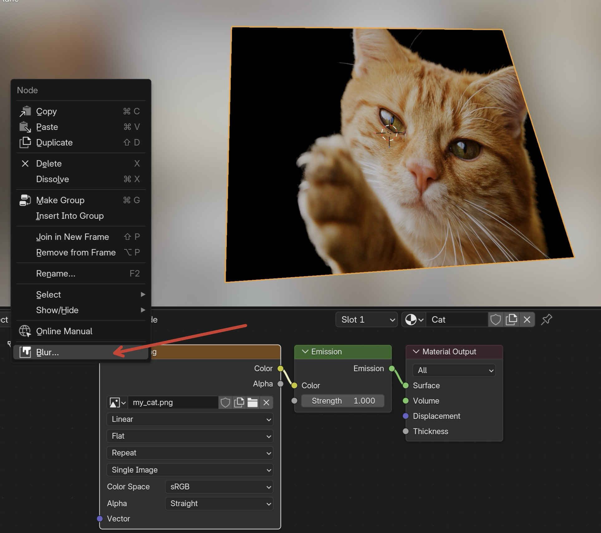

# blur_hdri

After installing the extension, you can right click an image texture node and use the "Blur..." option.

# Changelog

## version 0.0.5

Better dev setup

## version 0.0.4

* Add Right Click menu
* Drop Intel Mac support
* Update Versions